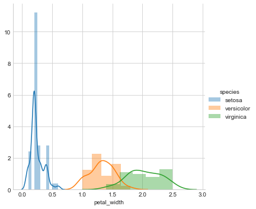
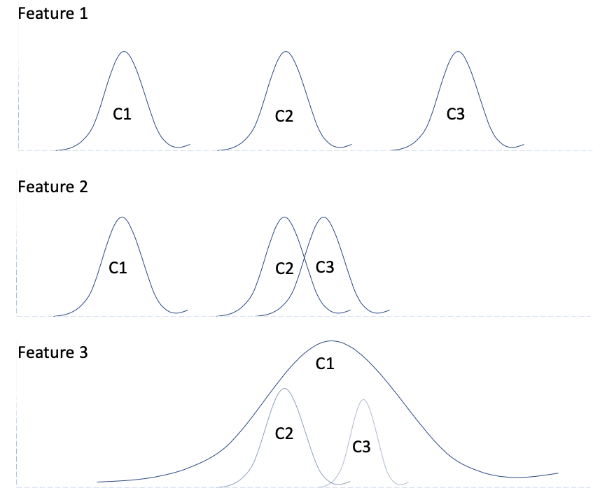

# Exploratory Data Analysis

#### 1- First steps when you get a new dataset?

* How many data points/row count/observations are there?
* What are the headers/column names/column descriptions
* What is the type of the data set
* What is the preliminary objective of the dataset - if classification then - 
  * How many classes
  * Is there class imbalance 

* NAN/Missing values 

* Extereme values 

* Incomplete data entries or rows 

* Range of each column, acceptable range 

* Who is giving us the data - *can we trust them?*

* How to check if we received all the data 

* Perform column analysis

* What is the refresh rate of the data

  * Is this data one time lookup or one time dump

  * If we receive it at a regular clip, what is the frequency - s, mm, hr, dd, qtr, yyyy

  * What is the volume/size of the transmit

  * What is the velocity/rate - batch or real time or near real time 

### 2-Basic Plots and Measures 

 **<u>Scatter Plot</u>** 

* Good to identify relationships between columns 
* Pari plots, pair wise scatter plots for more than three dimensions 
* If a straight line can seperate the classes correctly then the data set is called linearly seperable 
* Example pair plot of Petal lenght vs Petal Width from iris data set

     

**Histogram/Probability Density Function (PDF)** 

- Histogram is a frequency count of points, typically we the data is broken into buckets (binning/bucketing), ex if you have age as a features and we have 100 people, we can count number of people in age group 10-20, 21-30, 31-40 etc. 

- Smooth form of histogram is called probability density function, the process of smoothing out histogram is called Kernel Density Estimation (KDE)

- Area under PDF is always one 

- PDF's gives estimation of high and low density data points 

- PDF for continous random variable, Probability Mass Function for discrete random variable
- PDF's are used for calculating probabilites for a range not at individual point as the AUC is zero.
- PDF is not a probability 
- Example PDF of feature petal width from iris data set. This shows that we can clearly seperate setosa class from other two classes

**Univariate Analysis usnig PDF**

* one variable analysis 

* Helpful in identifying feature importance in a classification problem, example in the figure below we have three features F1, F2 and F3 and three classes C1, C2 and C3. The plots are pdfs of all the three features. We can clearly see that Feature1 is most important (and has the maximum variance) since it can clearly serperate the classes 

  

